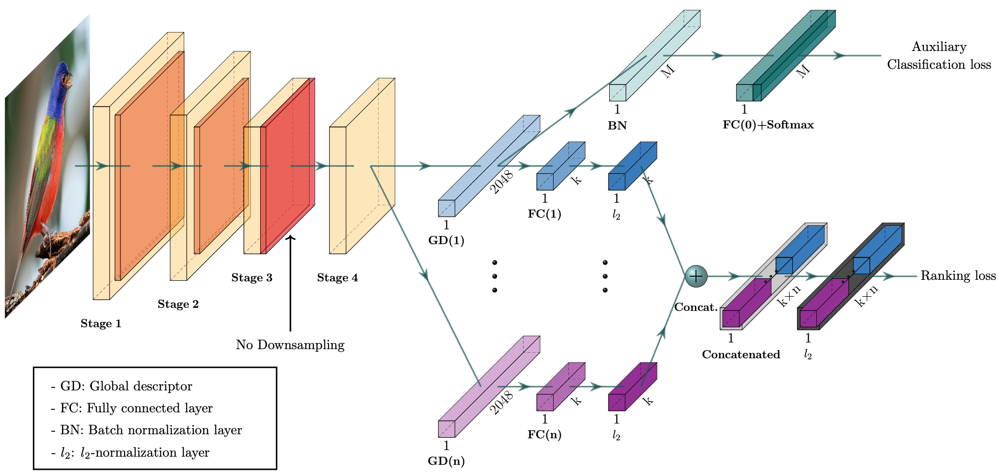

# Network Architecture




## What does this code do?
it's mainly doing visual search to check if an image existing in the encoded database or not, and provide the similar images to the input one. the database encoded into feature vectors using a pretrained similarity network built on top of resnet. each image in the database encoded into 1x512 feature vector.

When you search for specific image in the database, it encodes it and apply the cosine similarity between the feature vector of input image and all feature vectors in the database, then return if the input image  existing or not and similar images to it.
## Requirements (install only if you will test locally)
- install [miniconda](https://docs.conda.io/en/latest/miniconda.html) and create virtual env 

- install the required packages by: `pip install -r requirements.txt`
- Download the model weights from SageMaker instance that existed as: `wipo-encoder/assets/weights.pt`
- Download the encoded features from SageMaker instance that existed as: `wipo-encoder/assets/db.pth`


## Test 
I have encoded a sample of data for testing. Ideally, if you parse an image the encoded, the output should be `Trade Mark Existed! - serial number: <serial number>`. and if the input image is not encoded, it will return `Trade Mark Not Existed!`.

- you will find the encoded images in this file `assets/encoded_images.txt`
- please select the `conda_pytorch_latest_p36` as a notebook kernel (if you are testing on SageMaker)
- there are some samples for the encoded images in `images/encoded/` directory and also for the not encoded in `images/not_encoded/`
- you will find a plot of the similar images in the `plots` folder
```
python search.py --input-img <dir to the test img> --retrievals_num <integer e.g. 5>
```

### example: 
```pythonregexp
python search.py --input-img images/encoded/img7.png --retrievals-num 5
```
**the output:**
```text
Apply inference on the input image ...
loading database features ...
searching for the image in the encoded database ...

Trade Mark Existed! - serial number: 85932284

retrieving and plotting similar trade marks ...

Serial Numbers of similar images: ['85932284', '85395781', '85526801', '85664888', '85697027']
```
